# FILE: flowchart.md
# PART: 2 of 14
# DETAIL: Current State Architecture & Execution Flowcharts (v14.2, 2026-11-01) — boot, menus, Hero Creator v2, run start, the 60 FPS loop, simulation (Threat Sense clocks, Force-persuaded allies, Yoda's powers), Saber Form Engine, Rival Showdown, glory kills / EXECUTE, Nexus City, vehicles & convoys, roofs / fences / eye height, the HUD layout manager, rendering and end of run. Feature descriptions live in info.md.

## 1. Whole-game flow

```mermaid
flowchart TD
  %% === 1. BOOT (index.html + js/ui.js + js/state.js) ===
  subgraph BOOT["1. BOOT & DOM SHELL"]
    A["index.html: safe removeChild wrapper, live debugger, music player shell"] --> B["Ordered script loader: 23 files, cache-bust ?v=v13-2026-10-28"]
    B --> B2["chaos, data-factions, data-heroes, data-relics, state, world, combat, sim, render"]
    B2 --> B3["fx, rewind, arsenal, squad, glory, showdown (v12), sense (v13), force (v13), biomes, campaign, proving, saberforms (v11), creator (v13 v2), ui"]
    B3 --> C["checkLoadedScripts() + runDynamicEOFScan()"]
    C --> E["loadMeta(): localStorage OMNISHIFT_META_V1"]
    E --> E2["customHeroSanitize(meta.custom): v12 saves migrate to v2, then customHeroRegister() writes CHAR_RAW[80] + kit tables"]
    E2 --> F["updateMenuUI() -> Main Menu (#scrMain)"]
  end

  %% === 2. MENUS ===
  subgraph MENUS["2. MENU SCREENS"]
    F -->|DEPLOY INTO NEXUS| G["startRun() (js/combat.js)"]
    F -->|Character Roster| H["renderChars(): top card = Your Hero #80, then 80 heroes in 11 genres"]
    F -->|CREATE YOUR OWN HERO| CR["openCreator() -> #scrCreate (js/creator.js)"]
    H -->|EDIT / create card| CR
    H -->|hold 350ms| L["openInspector() + outfit customizer"]
    F -->|Galactic Expedition| CAMP["renderCampaign(): branching sector map, modifiers, warlords"]
    CAMP --> G
    F -->|Classic list| I["renderStages(): 50 sectors"]
    F -->|Shop| J["renderMeta(): Dark Matter upgrades + 100% respec"]
    F -->|Proving Ground| PG["startProvingGround(): 14 live actions, PASS / FAIL panel"]
    PG --> G
    F -->|Options / Codex / Health / Help| MISC["opts, codex, telemetry, HUD guide (NEW IN v13 box)"]
  end

  %% === 3. HERO CREATOR v2 (v13) ===
  subgraph CREATE["3. HERO CREATOR v2 #80 (js/creator.js)"]
    CR --> CR0["Presets: Jedi Knight, Sith Lord, Twin-Gun Drifter, Force-Touched Wizard, Space Cowboy, Smuggler, Mandalorian, Jar'Kai"]
    CR0 --> CR1["Identity: name, allegiance (Light / Dark / Grey / Bounty), Force (None / Touched / Strong), talent"]
    CR1 --> CR2["Weapons 1-3 from 26 (saber, staff, blades, pistols, rifles, heavy, magic, tech); twins = separate weapons"]
    CR2 --> CR3["Per lightsaber: hilt (10) + colour (10) + Form path"]
    CR3 --> CR4["Exactly 2 skills, 1 gear, 1 mobility, 1 armor - crReqOk() locks what the build can't use"]
    CR4 --> CR5["Look: species, body, skin, hair, headgear, outfit, legs, cloak; live preview (flight shown for beskar)"]
    CR5 -->|SAVE| CR6["meta.custom (v: 2) saved, selChar = 80, customHeroRegister()"]
    CR6 --> F
  end

  %% === 4. RUN START ===
  subgraph INIT["4. RUN INITIALIZATION (js/combat.js startRun)"]
    G --> N["purgeRunMemory(): clear every SoA pool"]
    N --> O["player object: stats, limbs[6], visor, dash spec, armCap, starting weapon + bladeCol"]
    O --> O2["hero stat block (#00-#79)"]
    O2 --> O3["hero #80 -> customHeroApplyRun(): 1-3 weapons (twinIdx, own cylinders), Force tier, talent, allegiance, armor (beskar: flying)"]
    O3 --> Q["syncHeroSpellbook()"]
    Q --> HK["V10.onRunStart hooks: campaign modifiers, adaptive biome, squads, rewind buffer, fx, glory reset, showdown reset, saber reset"]
    HK --> HK2["v13 hooks: senseReset (pre-rolled rival / Titan angles), forceReset (allies, Yoda timers), crKit reset"]
    HK2 --> HK3["v14 cityRunStart (first hook): world = Nexus City unless classic / Proving Ground -> seed, hero theme, drop zone -> local (256,256), tile prewarm, stealth director reset"]
    HK3 --> R["#hud active -> requestAnimationFrame(loop)"]
  end

  %% === 5. FRAME LOOP ===
  subgraph LOOP["5. 60 FPS FRAME LOOP (js/ui.js loop + js/sim.js)"]
    R --> LP["loop(ts): rawDt"]
    LP -->|timeScale >= 0.1| US["updateSim(rawDt * timeScale * fxTimeMul) in sub-steps"]
    LP -->|timeScale < 0| RW["rewindPlayback(): keyframe ring buffer, interpolation, echoes"]
    US --> RS["renderScene()"]
    RW --> RS
    RS --> HUD["updateHUD(): in-place DOM (weapons, skills, dash, limbs, spellbar)"]
    HUD --> OF["V10.onFrame hooks: EXECUTE button state, Threat Sense HUD meter, fx banners, proving panel, music UI; v14.1: vehicle gauge, HUD layout solver"]
    OF --> LP
  end

  %% === 6. SIMULATION STEP ===
  subgraph SIM["6. updateSim() - ONE STEP"]
    US --> S1["Input + movement + obstacles (city: wall collision, sneak speed; v14.1: vehDriveInput when driving, accRoofMove on a roof) + biome hazards (player.flying skips obstacles)"]
    S1 --> S2["Auto-aim: nearest on-screen enemy, skips staggered elites, the showdown crowd and allies"]
    S2 --> S3["Hand-slot loop (armCap)"]
    S3 -->|lightsaber / sword| SF["saberEngineStep(): guard -> wind-up -> strike -> recover, swept collision, deflect + redirect"]
    S3 -->|gun / staff / wand| FW["fireWeapon() -> spawnProj() / castArcaneSpell(); odd twins take the 2nd-nearest target; six-shooters use w.six"]
    S3 --> SP["updateHeroSpecials(): utilities, signature gear, dash, CQC"]
    SP --> MN["squadMinionsSim(): fireteams + minions (skip the crowd)"]
    MN --> SPN["Spawn director: wave population; titanClock + rivalTimer tick x threatMult() (1.0-2.1 by distance), frozen during a showdown; spawns x0.35"]
    SPN -->|rival / Titan due| RIV["spawnEnemy() at threatSpawnAngle() -> showdownBegin() for rivals"]
    SPN --> EN["Enemy AI loop (MAX_E = 360)"]
    EN --> EA["v13: allyIs(i)? -> allyEnemyStep(): hunt hostiles, friendly bolts, escort, lay down arms on expiry"]
    EA --> EN1["levitate / bleed / stagger / stun / grapple"]
    EN1 --> EN2["v12 showdownEnemyStep(): spectators hold the ring, rival entrance, challenger charge"]
    EN2 --> EN3["formations + ChaosMath steering (brawl with an ally within 62 px) + firing + contact damage"]
    EN3 --> PRJ["Projectile loop (MAX_P = 520): hits, deflection, ricochet, homing"]
    PRJ --> ORB["XP orbs -> triggerLevelUp() (#scrLevel, twin sabers get separate cards)"]
    ORB --> STEP["V10.onStep hooks: glory, showdown, Threat Sense (bands, cues), Force (persuade, Yoda lift / Will), creator kit (detonators, chokes), rewind, fx, squads, campaign, proving; v14.1: vehicle physics + fuel + noise, convoy AI, roof / fence / ladder steps, eye height"]
  end

  %% === 7. KILL PIPELINE ===
  subgraph KILL["7. killEnemy()"]
    SF --> K["killEnemy(idx, headshot, sliceAngle, glow)"]
    FW --> K
    EN3 --> K
    K --> K1["V10.onKill: rewind echo list, kill-streak fx, campaign counters"]
    K1 --> K2["corpse / bisected halves / limbs + XP orb (none for echoes or no-pay kills)"]
    K2 -->|Rival 98 or Titan 99| K3["weapon drop + relic + trophy corpse; rival death ends the showdown"]
    K3 -->|Titan| K4["onSectorTitanDefeated(): sector cleared, Dark Matter banked"]
  end

  %% === 8. RENDER ===
  subgraph RENDER["8. renderScene() (js/render.js)"]
    RS --> R1["fx camera: shake, zoom, focus, letterbox"]
    R1 --> R2["biome ground, props, hazards, world objects"]
    R2 --> R3["gore pools: drips, limbs, corpses, bisected halves"]
    R3 --> R4["enemies: grunts (spectators pump fists), allies (halo, ground ring, green bar), lifted foes, rivals as hero sprites"]
    R4 --> R5["drawHeroSprite(player): outfit, #80 species / armor / headgear / helmet, jetpack flight (lift + shadow + jets), Form-posed blades"]
    R5 --> R6["particles + projectiles + damage text"]
    R6 --> R7["V10.onRenderWorld: EXECUTE reticle, showdown ring, Threat pings, persuasion beams, Will of the Force wave, grenades"]
    R7 --> R8["V10.onRenderScreen: rewind VHS overlay, banners, Threat edge arrow + vignette, letterbox, perf pill"]
  end

  %% === 9. END OF RUN ===
  subgraph END["9. END OF RUN"]
    STEP -->|HP 0, no revives| X1["resolvePlayerDeath() -> endRun('death')"]
    PAUSE["Pause -> END RUN"] --> X2["endRun('quit')"]
    X1 --> X3["Dark Matter payout + summary screen (#scrSummary)"]
    X2 --> X3
    X3 -->|Deploy again / next sector / menu| F
  end
```

## 2. Rival Showdown state machine (js/showdown.js)

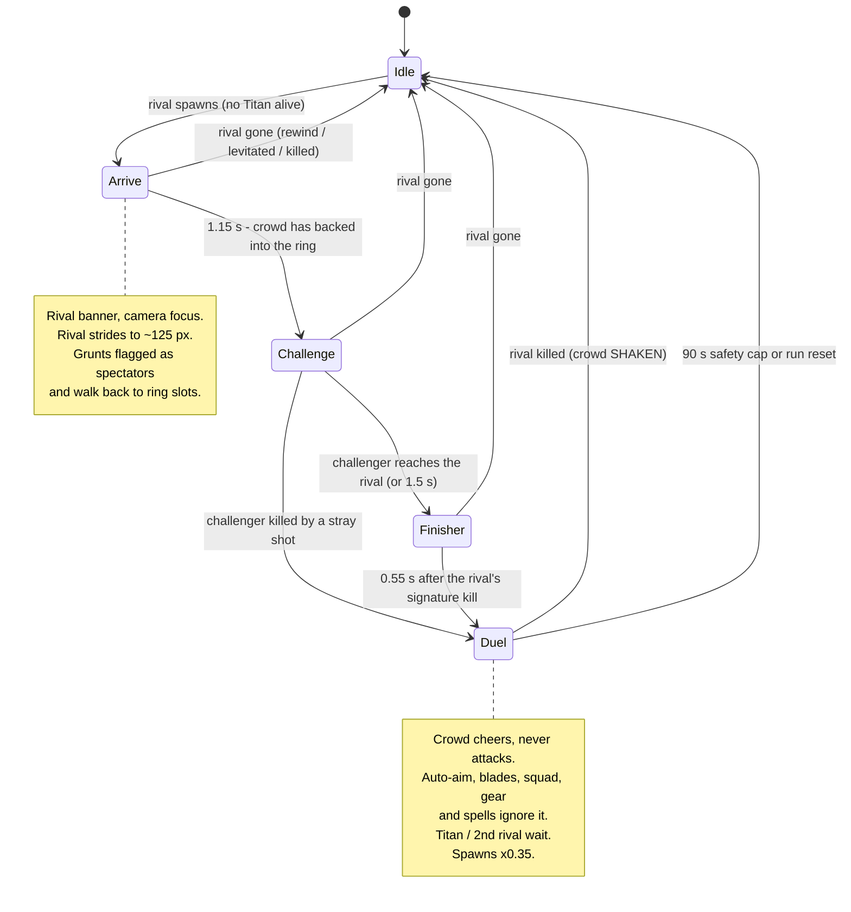
```mermaid
stateDiagram-v2
  [*] --> Idle
  Idle --> Arrive: rival spawns (no Titan alive)
  Arrive --> Challenge: 1.15 s - crowd has backed into the ring
  Challenge --> Finisher: challenger reaches the rival (or 1.5 s)
  Challenge --> Duel: challenger killed by a stray shot
  Finisher --> Duel: 0.55 s after the rival's signature kill
  Duel --> Idle: rival killed (crowd SHAKEN)
  Arrive --> Idle: rival gone (rewind / levitated / killed)
  Challenge --> Idle: rival gone
  Finisher --> Idle: rival gone
  Duel --> Idle: 90 s safety cap or run reset
  note right of Arrive
    Rival banner, camera focus.
    Rival strides to ~125 px.
    Grunts flagged as spectators
    and walk back to ring slots.
  end note
  note right of Duel
    Crowd cheers, never attacks.
    Auto-aim, blades, squad, gear
    and spells ignore it.
    Titan / 2nd rival wait.
    Spawns x0.35.
  end note
```

## 3. EXECUTE button states (js/glory.js, v12)

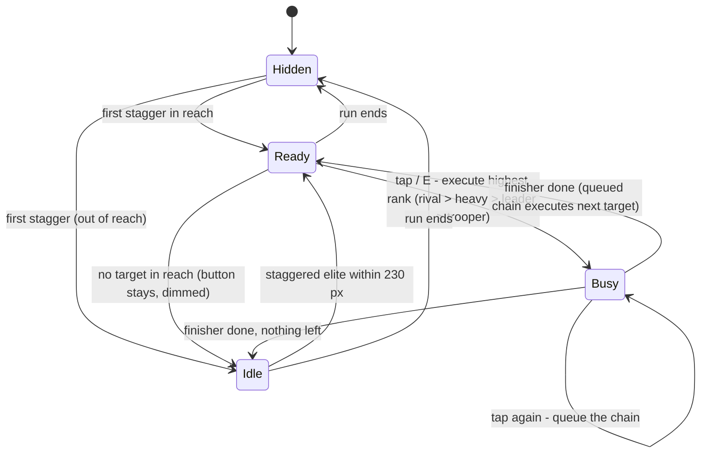
```mermaid
stateDiagram-v2
  [*] --> Hidden
  Hidden --> Ready: first stagger in reach
  Hidden --> Idle: first stagger (out of reach)
  Idle --> Ready: staggered elite within 230 px
  Ready --> Idle: no target in reach (button stays, dimmed)
  Ready --> Busy: tap / E - execute highest rank (rival > heavy > leader > trooper)
  Busy --> Busy: tap again - queue the chain
  Busy --> Ready: finisher done (queued chain executes next target)
  Busy --> Idle: finisher done, nothing left
  Idle --> Hidden: run ends
  Ready --> Hidden: run ends
```

## 4. Custom hero data flow (#80, Creator v2)

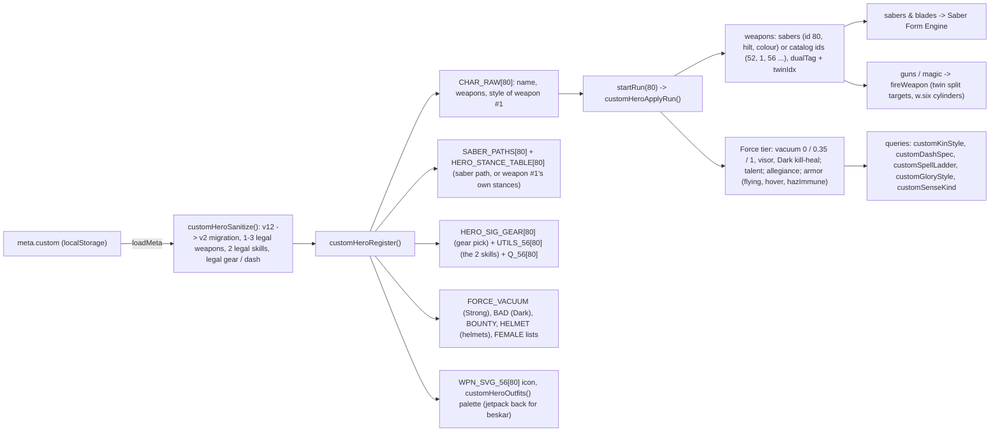
```mermaid
flowchart LR
  D["meta.custom (localStorage)"] -->|loadMeta| S["customHeroSanitize(): v12 -> v2 migration, 1-3 legal weapons, 2 legal skills, legal gear / dash"]
  S --> REG["customHeroRegister()"]
  REG --> C1["CHAR_RAW[80]: name, weapons, style of weapon #1"]
  REG --> C2["SABER_PATHS[80] + HERO_STANCE_TABLE[80] (saber path, or weapon #1's own stances)"]
  REG --> C3["HERO_SIG_GEAR[80] (gear pick) + UTILS_56[80] (the 2 skills) + Q_56[80]"]
  REG --> C4["FORCE_VACUUM (Strong), BAD (Dark), BOUNTY, HELMET (helmets), FEMALE lists"]
  REG --> C5["WPN_SVG_56[80] icon, customHeroOutfits() palette (jetpack back for beskar)"]
  C1 --> RUN["startRun(80) -> customHeroApplyRun()"]
  RUN --> W["weapons: sabers (id 80, hilt, colour) or catalog ids (52, 1, 56 ...), dualTag + twinIdx"]
  RUN --> P["Force tier: vacuum 0 / 0.35 / 1, visor, Dark kill-heal; talent; allegiance; armor (flying, hover, hazImmune)"]
  W --> ENG["sabers & blades -> Saber Form Engine"]
  W --> GUN["guns / magic -> fireWeapon (twin split targets, w.six cylinders)"]
  P --> Q["queries: customKinStyle, customDashSpec, customSpellLadder, customGloryStyle, customSenseKind"]
```

## 5. Threat Sense (js/sense.js, v13)

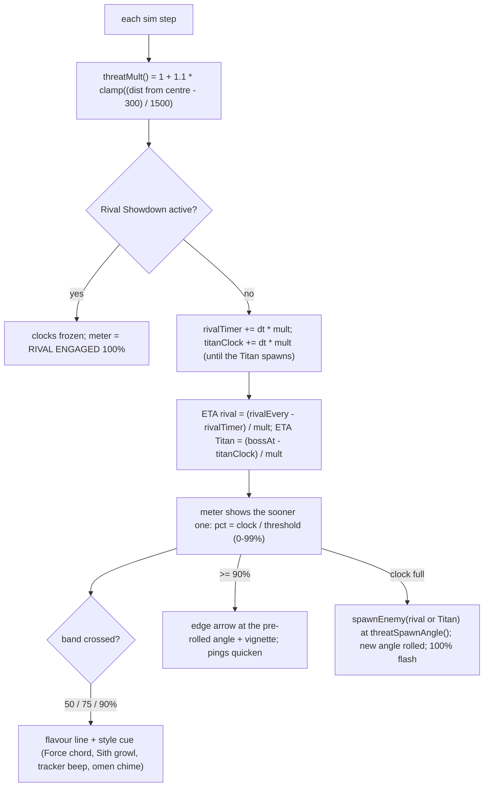
```mermaid
flowchart TD
  T0["each sim step"] --> T1["threatMult() = 1 + 1.1 * clamp((dist from centre - 300) / 1500)"]
  T1 --> T2{"Rival Showdown active?"}
  T2 -->|yes| T3["clocks frozen; meter = RIVAL ENGAGED 100%"]
  T2 -->|no| T4["rivalTimer += dt * mult; titanClock += dt * mult (until the Titan spawns)"]
  T4 --> T5["ETA rival = (rivalEvery - rivalTimer) / mult; ETA Titan = (bossAt - titanClock) / mult"]
  T5 --> T6["meter shows the sooner one: pct = clock / threshold (0-99%)"]
  T6 --> T7{"band crossed?"}
  T7 -->|50 / 75 / 90%| T8["flavour line + style cue (Force chord, Sith growl, tracker beep, omen chime)"]
  T6 -->|>= 90%| T9["edge arrow at the pre-rolled angle + vignette; pings quicken"]
  T6 -->|clock full| T10["spawnEnemy(rival or Titan) at threatSpawnAngle(); new angle rolled; 100% flash"]
```

## 6. Force Persuasion ally lifecycle (js/force.js, v13)

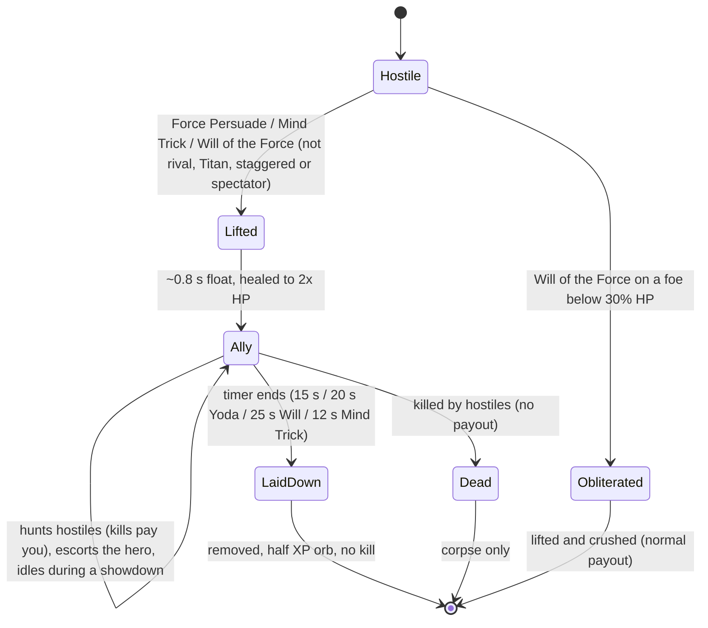
```mermaid
stateDiagram-v2
  [*] --> Hostile
  Hostile --> Lifted: Force Persuade / Mind Trick / Will of the Force (not rival, Titan, staggered or spectator)
  Lifted --> Ally: ~0.8 s float, healed to 2x HP
  Ally --> Ally: hunts hostiles (kills pay you), escorts the hero, idles during a showdown
  Ally --> LaidDown: timer ends (15 s / 20 s Yoda / 25 s Will / 12 s Mind Trick)
  Ally --> Dead: killed by hostiles (no payout)
  LaidDown --> [*]: removed, half XP orb, no kill
  Dead --> [*]: corpse only
  Hostile --> Obliterated: Will of the Force on a foe below 30% HP
  Obliterated --> [*]: lifted and crushed (normal payout)
```

## 7. Yoda's Grand Master powers (by saber level)

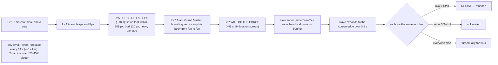
```mermaid
flowchart LR
  L1["Lv.1-3 Soresu: small shoto cuts"] --> L4["Lv.4 Ataru: leaps and flips"]
  L4 --> L5["Lv.5 FORCE LIFT & HURL (~10 s): lift up to 8 within 205 px, hurl 120 px, heavy damage"]
  L5 --> L7["Lv.7 Ataru Grand Master: bounding leaps carry his body from foe to foe"]
  L7 --> W["Lv.7 WILL OF THE FORCE (~45 s, 8+ foes on screen)"]
  W --> W1["stow saber (saberStowT) + raise hand + slow-mo + banner"]
  W1 --> W2["wave expands to the screen edge over 0.9 s"]
  W2 --> W3{"each foe the wave touches"}
  W3 -->|rival / Titan| W4["RESISTS - stunned"]
  W3 -->|below 30% HP| W5["obliterated"]
  W3 -->|everyone else| W6["turned: ally for 25 s"]
  ALL["any level: Force Persuade every 14 s (4-6 allies); Tutaminis ward 25-45% bigger"]
```

## 8. Nexus City pipeline (v14)

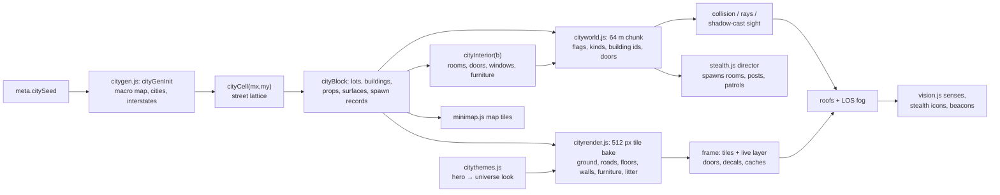
```mermaid
flowchart LR
  SEED["meta.citySeed"] --> GEN["citygen.js: cityGenInit<br/>macro map, cities, interstates"]
  GEN --> CELL["cityCell(mx,my)<br/>street lattice"]
  CELL --> BLOCK["cityBlock: lots, buildings,<br/>props, surfaces, spawn records"]
  BLOCK --> INT["cityInterior(b)<br/>rooms, doors, windows, furniture"]
  BLOCK --> CHUNK["cityworld.js: 64 m chunk<br/>flags, kinds, building ids, doors"]
  INT --> CHUNK
  CHUNK --> COL["collision / rays /<br/>shadow-cast sight"]
  CHUNK --> DIR["stealth.js director<br/>spawns rooms, posts, patrols"]
  BLOCK --> BAKE["cityrender.js: 512 px tile bake<br/>ground, roads, floors, walls, furniture, litter"]
  THEME["citythemes.js<br/>hero → universe look"] --> BAKE
  BAKE --> FRAME["frame: tiles + live layer<br/>doors, decals, caches"]
  COL --> FOG["roofs + LOS fog"]
  FRAME --> FOG --> SENSE["vision.js senses,<br/>stealth icons, beacons"]
  BLOCK --> MAP["minimap.js map tiles"]
```

## 9. Enemy AI states (js/stealth.js)

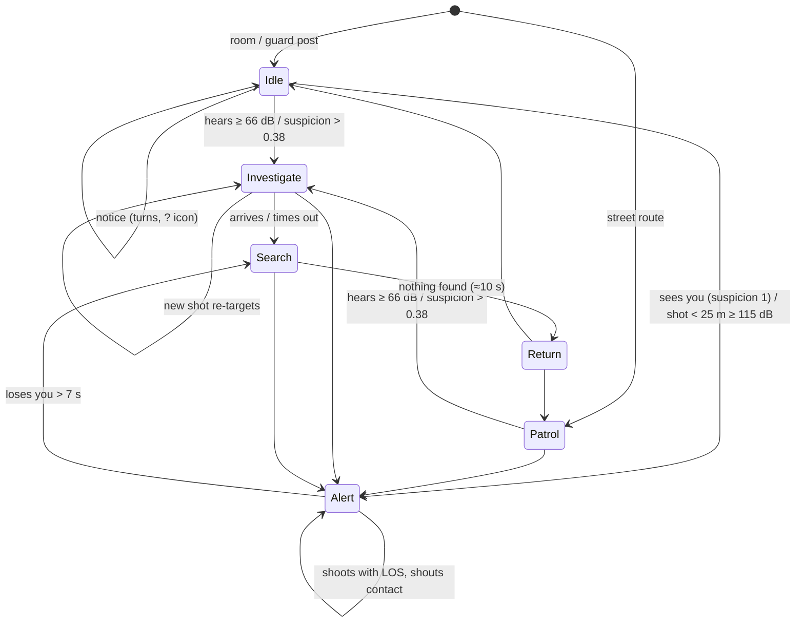
```mermaid
stateDiagram-v2
  [*] --> Idle: room / guard post
  [*] --> Patrol: street route
  Idle --> Investigate: hears ≥ 66 dB / suspicion > 0.38
  Patrol --> Investigate: hears ≥ 66 dB / suspicion > 0.38
  Idle --> Idle: notice (turns, ? icon)
  Investigate --> Investigate: new shot re-targets
  Investigate --> Search: arrives / times out
  Search --> Return: nothing found (≈10 s)
  Return --> Idle
  Return --> Patrol
  Idle --> Alert: sees you (suspicion 1) / shot < 25 m ≥ 115 dB
  Patrol --> Alert
  Investigate --> Alert
  Search --> Alert
  Alert --> Alert: shoots with LOS, shouts contact
  Alert --> Search: loses you > 7 s
```

## 10. How far a sound carries

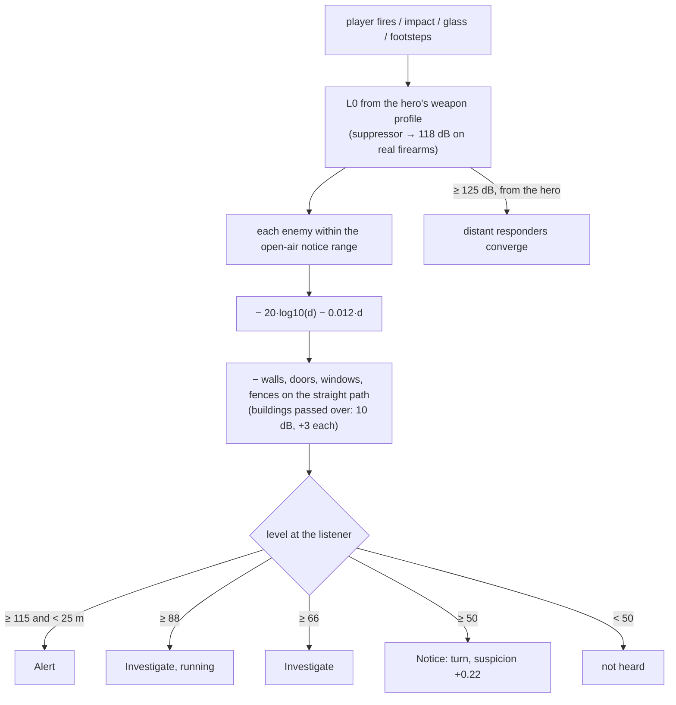
```mermaid
flowchart TD
  SHOT["player fires / impact / glass / footsteps"] --> L0["L0 from the hero's weapon profile<br/>(suppressor → 118 dB on real firearms)"]
  L0 --> EACH["each enemy within the open-air notice range"]
  EACH --> D["− 20·log10(d) − 0.012·d"]
  D --> WALLS["− walls, doors, windows, fences on the straight path<br/>(buildings passed over: 10 dB, +3 each)"]
  WALLS --> TH{"level at the listener"}
  TH -- "≥ 115 and < 25 m" --> COMBAT["Alert"]
  TH -- "≥ 88" --> URGENT["Investigate, running"]
  TH -- "≥ 66" --> INV["Investigate"]
  TH -- "≥ 50" --> NOTICE["Notice: turn, suspicion +0.22"]
  TH -- "< 50" --> NONE["not heard"]
  L0 -- "≥ 125 dB, from the hero" --> RESP["distant responders converge"]
```

## 11. Marker visibility (js/minimap.js)

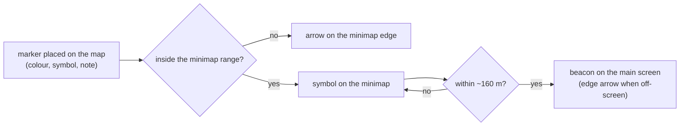
```mermaid
flowchart LR
  M["marker placed on the map<br/>(colour, symbol, note)"] --> FAR{"inside the minimap range?"}
  FAR -- no --> EDGE["arrow on the minimap edge"]
  FAR -- yes --> MINI["symbol on the minimap"]
  MINI --> NEAR{"within ~160 m?"}
  NEAR -- yes --> BEAM["beacon on the main screen<br/>(edge arrow when off-screen)"]
  NEAR -- no --> MINI
```

## 12. A vehicle's life (js/vehicles.js, v14.1)

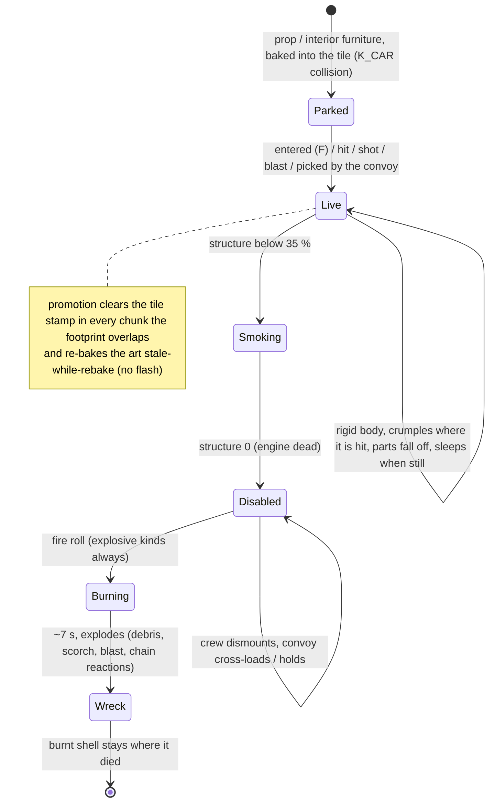
```mermaid
stateDiagram-v2
  [*] --> Parked: prop / interior furniture, baked into the tile (K_CAR collision)
  Parked --> Live: entered (F) / hit / shot / blast / picked by the convoy
  Live --> Live: rigid body, crumples where it is hit, parts fall off, sleeps when still
  Live --> Smoking: structure below 35 %
  Smoking --> Disabled: structure 0 (engine dead)
  Disabled --> Burning: fire roll (explosive kinds always)
  Burning --> Wreck: ~7 s, explodes (debris, scorch, blast, chain reactions)
  Disabled --> Disabled: crew dismounts, convoy cross-loads / holds
  Wreck --> [*]: burnt shell stays where it died
  note right of Live
    promotion clears the tile stamp in every chunk the footprint overlaps
    and re-bakes the art stale-while-rebake (no flash)
  end note
```

## 13. One hit on a vehicle (vehDamage)

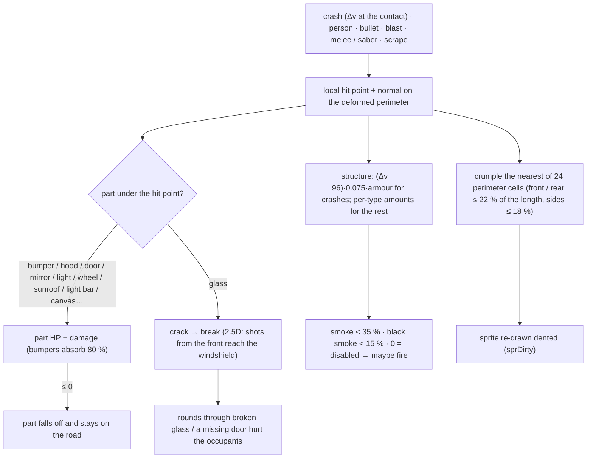
```mermaid
flowchart TD
  SRC["crash (Δv at the contact) · person · bullet · blast · melee / saber · scrape"] --> LOC["local hit point + normal on the deformed perimeter"]
  LOC --> HP["structure: (Δv − 96)·0.075·armour for crashes; per-type amounts for the rest"]
  LOC --> DENT["crumple the nearest of 24 perimeter cells (front / rear ≤ 22 % of the length, sides ≤ 18 %)"]
  LOC --> PART{"part under the hit point?"}
  PART -- "bumper / hood / door / mirror / light / wheel / sunroof / light bar / canvas…" --> PHP["part HP − damage (bumpers absorb 80 %)"]
  PHP -- "≤ 0" --> OFF["part falls off and stays on the road"]
  PART -- glass --> GL["crack → break (2.5D: shots from the front reach the windshield)"]
  GL --> OCC["rounds through broken glass / a missing door hurt the occupants"]
  HP --> STATE["smoke < 35 % · black smoke < 15 % · 0 = disabled → maybe fire"]
  DENT --> SPR["sprite re-drawn dented (sprDirty)"]
```

## 14. Squad riders & the tactical convoy (js/convoy.js, v14.1)

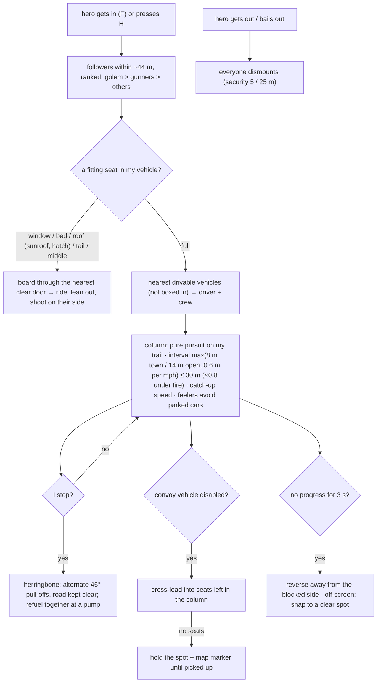
```mermaid
flowchart TD
  IN["hero gets in (F) or presses H"] --> NEAR["followers within ~44 m, ranked: golem > gunners > others"]
  NEAR --> SEAT{"a fitting seat in my vehicle?"}
  SEAT -- "window / bed / roof (sunroof, hatch) / tail / middle" --> RIDE["board through the nearest clear door → ride, lean out, shoot on their side"]
  SEAT -- full --> CAND["nearest drivable vehicles (not boxed in) → driver + crew"]
  CAND --> COL["column: pure pursuit on my trail · interval max(8 m town / 14 m open, 0.6 m per mph) ≤ 30 m (×0.8 under fire) · catch-up speed · feelers avoid parked cars"]
  COL --> HALT{"I stop?"}
  HALT -- yes --> HB["herringbone: alternate 45° pull-offs, road kept clear; refuel together at a pump"]
  HALT -- no --> COL
  COL --> HIT{"convoy vehicle disabled?"}
  HIT -- yes --> XL["cross-load into seats left in the column"]
  XL -- no seats --> HOLD["hold the spot + map marker until picked up"]
  COL --> STUCK{"no progress for 3 s?"}
  STUCK -- yes --> REC["reverse away from the blocked side · off-screen: snap to a clear spot"]
  OUT["hero gets out / bails out"] --> DIS["everyone dismounts (security 5 / 25 m)"]
```

## 15. Fences, roofs & eye height (js/cityaccess.js, v14.1)

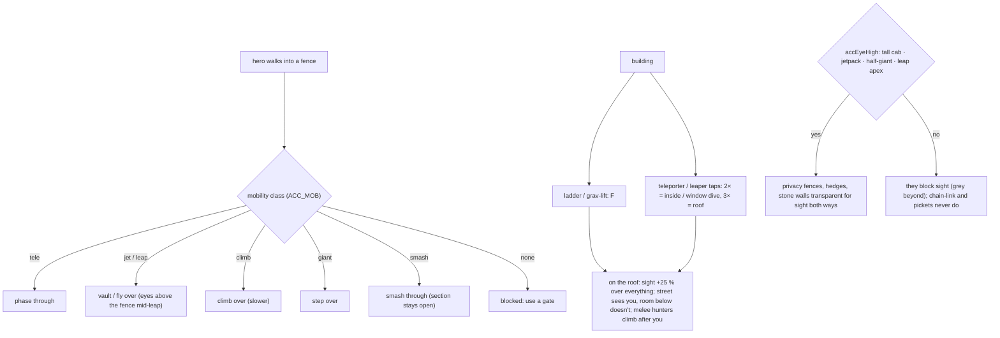
```mermaid
flowchart TD
  F["hero walks into a fence"] --> CLS{"mobility class (ACC_MOB)"}
  CLS -- tele --> PH["phase through"]
  CLS -- "jet / leap" --> VAULT["vault / fly over (eyes above the fence mid-leap)"]
  CLS -- climb --> SCALE["climb over (slower)"]
  CLS -- giant --> STEP["step over"]
  CLS -- smash --> BREAK["smash through (section stays open)"]
  CLS -- none --> GATE["blocked: use a gate"]
  R["building"] --> LAD["ladder / grav-lift: F"]
  R --> TAP["teleporter / leaper taps: 2× = inside / window dive, 3× = roof"]
  LAD --> ROOF["on the roof: sight +25 % over everything; street sees you, room below doesn't; melee hunters climb after you"]
  TAP --> ROOF
  EYE{"accEyeHigh: tall cab · jetpack · half-giant · leap apex"} -- yes --> SEE["privacy fences, hedges, stone walls transparent for sight both ways"]
  EYE -- no --> GREY["they block sight (grey beyond); chain-link and pickets never do"]
```

## 16. HUD layout manager (js/hudlayout.js, v14.1)

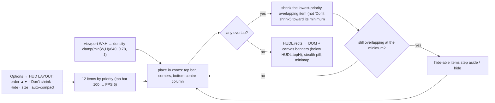
```mermaid
flowchart LR
  OPT["Options → HUD LAYOUT: order ▲▼ · Don't shrink · Hide · size · auto-compact"] --> PRIO["12 items by priority (top bar 100 … FPS 6)"]
  VIEW["viewport W×H → density clamp(min(W,H)/640, 0.78, 1)"] --> PLACE
  PRIO --> PLACE["place in zones: top bar, corners, bottom-centre column"]
  PLACE --> OV{"any overlap?"}
  OV -- yes --> SHR["shrink the lowest-priority overlapping item (not 'Don't shrink') toward its minimum"]
  SHR --> HIDE{"still overlapping at the minimum?"}
  HIDE -- yes --> MOVE["hide-able items step aside / hide"]
  HIDE -- no --> PLACE
  MOVE --> PLACE
  OV -- no --> OUT["HUDL.rects → DOM + canvas banners (below HUDL.topH), stealth pill, minimap"]
```

## 17. Run start in v14.2: world, scenario, people (js/location.js, js/regiongen.js, js/realui.js, js/scenario.js)

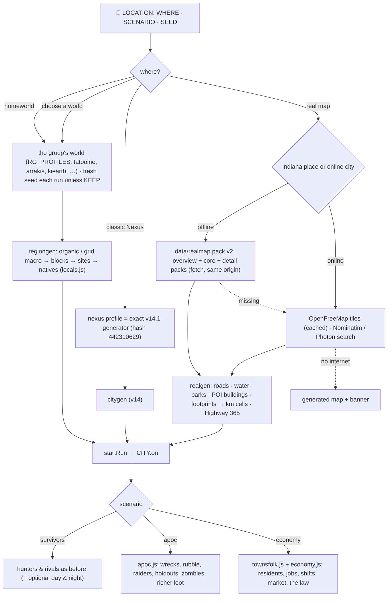
```mermaid
flowchart TD
  LOC["📍 LOCATION: WHERE · SCENARIO · SEED"] --> W{"where?"}
  W -- homeworld --> HW["the group's world (RG_PROFILES: tatooine, arrakis, kiearth, …) · fresh seed each run unless KEEP"]
  W -- "choose a world" --> HW
  W -- "classic Nexus" --> NX["nexus profile = exact v14.1 generator (hash 442310629)"]
  W -- "real map" --> RM{"Indiana place or online city"}
  RM -- offline --> PK["data/realmap pack v2: overview + core + detail packs (fetch, same origin)"]
  RM -- online --> OF["OpenFreeMap tiles (cached) · Nominatim / Photon search"]
  PK --> RG["realgen: roads · water · parks · POI buildings · footprints → km cells · Highway 365"]
  OF --> RG
  PK -. "missing" .-> OF
  OF -. "no internet" .-> FB["generated map + banner"]
  HW --> GEN["regiongen: organic / grid macro → blocks → sites → natives (locals.js)"]
  NX --> GEN0["citygen (v14)"]
  RG --> RUN["startRun → CITY.on"]
  GEN --> RUN
  GEN0 --> RUN
  RUN --> SC{"scenario"}
  SC -- survivors --> S1["hunters & rivals as before (+ optional day & night)"]
  SC -- apoc --> S2["apoc.js: wrecks, rubble, raiders, holdouts, zombies, richer loot"]
  SC -- economy --> S3["townsfolk.js + economy.js: residents, jobs, shifts, market, the law"]
```

## 18. One person in the Simulated Economy (js/townsfolk.js, js/economy.js)

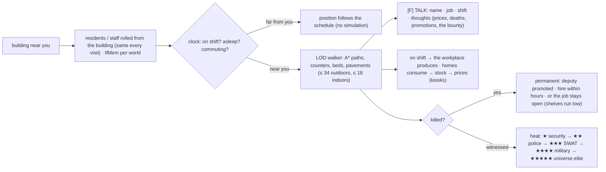
```mermaid
flowchart LR
  B["building near you"] --> POP["residents / staff rolled from the building (same every visit) · tfMem per world"]
  POP --> SCH{"clock: on shift? asleep? commuting?"}
  SCH -- far from you --> ABS["position follows the schedule (no simulation)"]
  SCH -- near you --> WALK["LOD walker: A* paths, counters, beds, pavements (≤ 34 outdoors, ≤ 18 indoors)"]
  WALK --> TALK["[F] TALK: name · job · shift · thoughts (prices, deaths, promotions, the bounty)"]
  WALK --> PROD["on shift → the workplace produces · homes consume → stock → prices (kiosks)"]
  WALK --> DIE{"killed?"}
  DIE -- yes --> JOB["permanent: deputy promoted · hire within hours · or the job stays open (shelves run low)"]
  DIE -- witnessed --> LAW["heat: ★ security → ★★ police → ★★★ SWAT → ★★★★ military → ★★★★★ universe elite"]
```

## 19. Flight (js/flight.js)

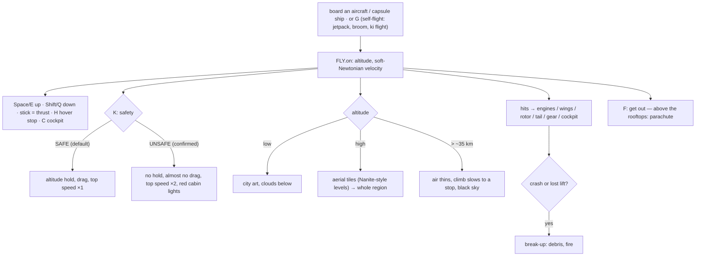
```mermaid
flowchart TD
  IN["board an aircraft / capsule ship · or G (self-flight: jetpack, broom, ki flight)"] --> AIR["FLY.on: altitude, soft-Newtonian velocity"]
  AIR --> CTRL["Space/E up · Shift/Q down · stick = thrust · H hover stop · C cockpit"]
  AIR --> SAFE{"K: safety"}
  SAFE -- "SAFE (default)" --> AS["altitude hold, drag, top speed ×1"]
  SAFE -- "UNSAFE (confirmed)" --> UN["no hold, almost no drag, top speed ×2, red cabin lights"]
  AIR --> ALT{"altitude"}
  ALT -- "low" --> CITYART["city art, clouds below"]
  ALT -- "high" --> AER["aerial tiles (Nanite-style levels) → whole region"]
  ALT -- "> ~35 km" --> SPACE["air thins, climb slows to a stop, black sky"]
  AIR --> DMG["hits → engines / wings / rotor / tail / gear / cockpit"]
  DMG --> CR{"crash or lost lift?"}
  CR -- yes --> BRK["break-up: debris, fire"]
  AIR --> F["F: get out — above the rooftops: parachute"]
```

## 20. Ki-Surge power-up & Instant Transmission (js/kisurge.js)

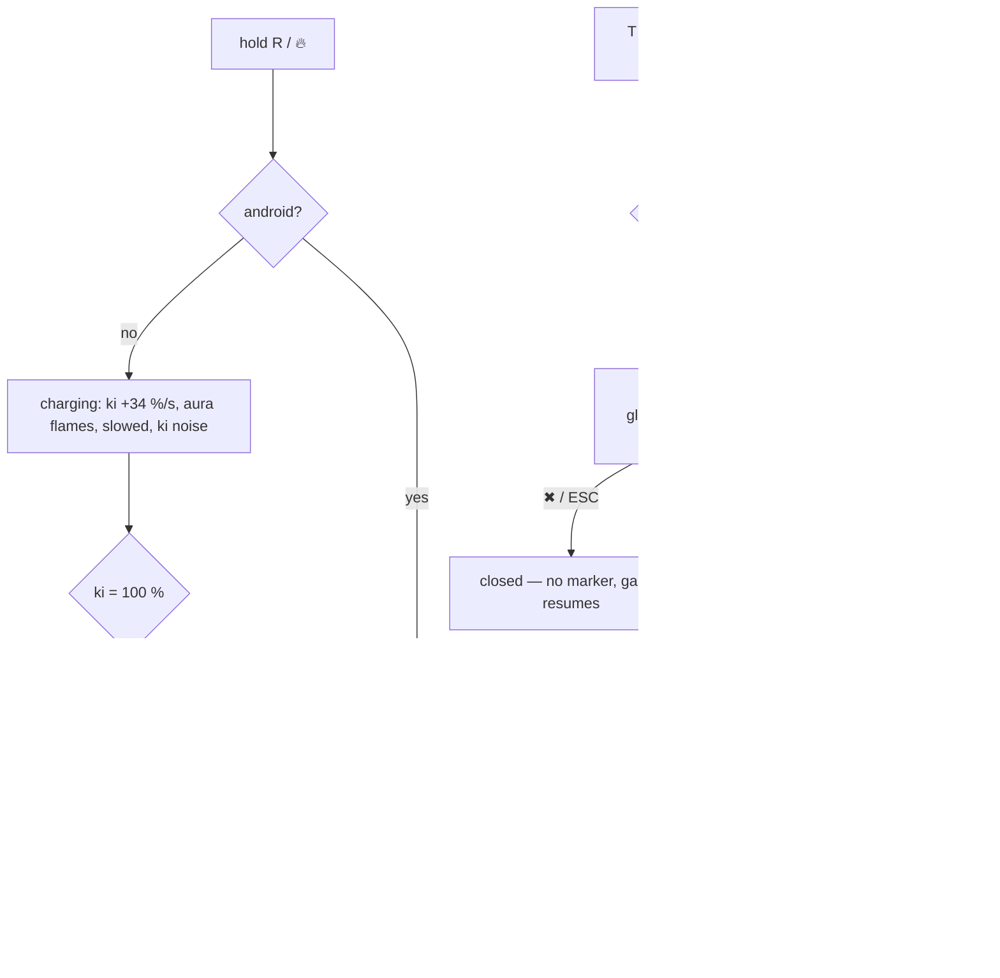
```mermaid
flowchart TD
  R["hold R / 🔥"] --> AND{"android?"}
  AND -- yes --> OD["OVERDRIVE at once (18 s)"]
  AND -- no --> CH["charging: ki +34 %/s, aura flames, slowed, ki noise"]
  CH --> FULL{"ki = 100 %"}
  FULL --> FORM["GOLDEN FORM (Saiyans) · FULL POWER (Frieza) · PERFECT POWER (Cell) · NAMEKIAN FOCUS (Piccolo) — 36 s"]
  FORM --> END["back to base: stats restored, 20 s recovery"]
  OD --> END
  T["T / IT (Goku, or Cell with it absorbed)"] --> CD{"recharged (≤ 1 s)?"}
  CD -- yes --> MAP["aiming map (paused): glowing IT reticle · never a marker"]
  MAP -- tap --> POSE["fingers to the forehead + static (0.42 s)"]
  POSE --> JUMP["arrive: static burst · flight / vehicle exited"]
  MAP -- "✖ / ESC" --> BACK["closed — no marker, game resumes"]
```

## 21. Rival evasion & the bounty (js/rivalchase.js)

```mermaid
flowchart LR
  RV["rival team (open world)"] --> D{"> 350 m for 6 s?"}
  D -- no --> RV
  D -- yes --> EV["RIVAL EVADED · BOUNTY UP — team leaves, duel ring closes, 🎯 +1"]
  EV --> WAIT["60–100 s"]
  WAIT --> RET["same rival + 1 partner per evasion (max 4, own universe), Showdown"]
  RET --> D
  RET --> K{"leader finished?"}
  K -- yes --> PAY["stake claimed: cash + XP · bounty − evasions · count reset"]
```

## 22. Traffic at a junction (js/traffic.js)

```mermaid
flowchart LR
  L["car on its lane (IDM: keeps the gap)"] --> A{"near the junction?"}
  A -- no --> L
  A -- yes --> N["pick the next road (straight > right > left)"]
  N --> C{"control"}
  C -- signal --> S{"my phase"}
  S -- green --> B{"room beyond the box?"}
  S -- amber --> Y{"can stop comfortably?"} -- yes --> W["stop at the line"]
  Y -- no --> B
  S -- red --> W
  C -- "stop sign / side road" --> F["full stop 0.7 s"] --> G{"box free and no main-road car within 3 s?"} -- yes --> B
  G -- no --> F
  C -- "main road, unmarked" --> B
  B -- yes --> T["Bézier turn through the box, indicators"] --> L
  B -- no --> W
  W --> C
```

## 23. A traffic stop (js/police.js)

```mermaid
flowchart TD
  O["speeding on a road · red light · crash"] --> Wt{"a cop saw it? (cruiser with line of sight / officer on foot)"}
  Wt -- no --> X["nothing happens"]
  Wt -- yes --> CH["🚨 PULL OVER — the cruiser follows your path"]
  CH --> STOP{"you stop?"}
  STOP -- "no (16 s, still fast)" --> EV["🚨 EVADING — economy heat up"] --> LOST{"out of sight 7–10 s?"}
  LOST -- yes --> FREE["you lost them"]
  LOST -- no --> STOP
  STOP -- yes --> PARK["cruiser parks behind you"] --> WALK["officer walks to your window"] --> TALK["talk: sorry / license / hurry / floor it"]
  TALK -- "floor it" --> EV
  TALK --> WARN{"small offense + polite?"} -- "warning" --> GO["drive safe"]
  WARN -- ticket --> PAY{"wallet ≥ fine?"}
  PAY -- yes --> BANK["auto-paid · 🏦 −$X watch notification"] --> GO
  PAY -- no --> JAIL["fade: 'you couldn't afford the ticket — a night in jail'"] --> AM["07:00 next day, out of the police station, car impounded"]
```

## 24. The ACTION button (js/actionui.js)

```mermaid
flowchart LR
  F["every frame: findInteractTarget()"] --> T{"a target?"}
  T -- yes --> SHOW["show icon + words (live)"]
  T -- no --> M{"seen < 2.6 s ago and < 72 px away?"}
  M -- yes --> STK["keep showing it (sticky)"]
  M -- no --> R{"on a roof?"}
  R -- yes --> GD["⬇ GET DOWN"]
  R -- no --> HIDE["hide"]
  SHOW --> TAP["tap (works while moving)"]
  STK --> TAP
  GD --> TAP
  TAP --> V{"moving vehicle exit?"} -- yes --> HOLD["hold 0.38 s"] --> DO["do it (a remembered target is forced through the interact chain)"]
  V -- no --> DO
```

## 25. Two guns, two targets (js/dualaim.js)

```mermaid
flowchart TD
  A[Every 0.12 s] --> B{Two or more ranged weapons in hand?}
  B -- no --> Z[Classic aim: every weapon follows player.aim]
  B -- yes --> C[Sort on-screen enemies by distance]
  P[Neo's Uzis: one weapon, two hands] --> B
  C --> D{Any enemy?}
  D -- no --> Y[Hands drift back to player.aim / low ready]
  D -- yes --> E[Hand 1 → nearest]
  E --> F{Nearest within 3.4 m and the only one that close?}
  F -- yes --> G[Every hand on that target]
  F -- no --> H[Each later hand → nearest target nobody covers yet<br/>none left → nearest]
  G --> I[Each frame: turn each hand toward its target at its own speed]
  H --> I
  I --> J[fireWeapon w → shoots at dualAimTarget w]
```

